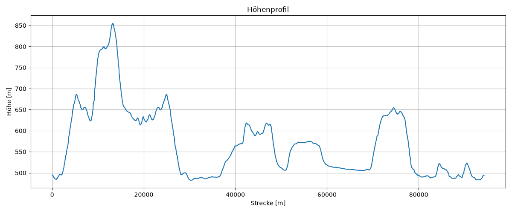
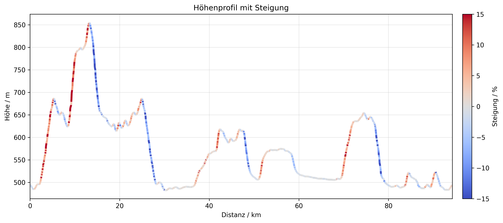
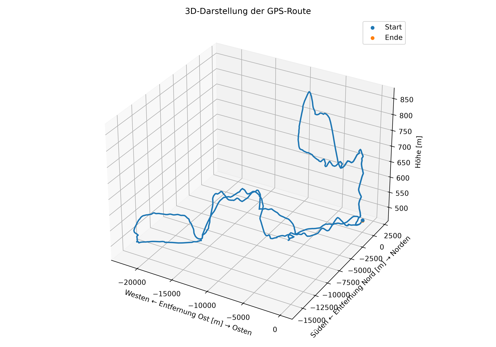

# Simulationsergebnisse

## Wetterdaten

| Messgröße | Wert |
|---|---:|
| Minimale Temperatur | 23.49 °C |
| Maximale Temperatur | 30.91 °C |
| Durchschnittstemperatur | 27.59 °C |
| Anzahl der Messwerte | 2284 |

## Diagramme

### Hoehenprofil

### Hoehenprofil Steigung

### Route 3D

